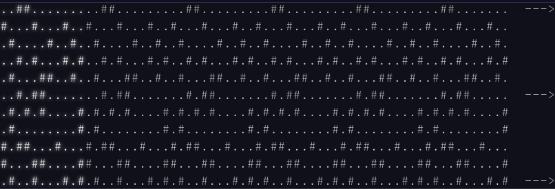

[Advent of code 2020](https://adventofcode.com/2020/about) starts today!  
__Advent of Code is an Advent calendar of small programming puzzles for a variety of skill sets and skill levels that can be solved in any programming language you like. People use them as a speed contest, interview prep, company training, university coursework, practice problems, or to challenge each other.__

I am joining the event for the second time, and will write a bit about the coding journey...
<!--more-->

# The event

Advent of code (AoC) is a coding event taking place every year on december. From the 1st of December to the 25th, a new puzzle is released daily.

Each puzzle comes with a description, inputs, and is made of 2 parts.
Resolving a part unlock a :star: -> there are **50 stars to collect**.

The complexity goes crescendo: puzzles get harder every day.
Since the input/output are handled as plain text, challengers are free to use the language of their choice.
# 2019
Last year I only learned about the event on the 7th. I wanted to learn Python3 for a long time, therefore AoC gave me a good reason to practice.  
As a Java programmer, python ObjectOriented programming and unitTest were familiar (Junit is quite similar). Numpi on the other hand was quite a discovery!
**19/50**:start:
# 2020
## Stack
This year I will reiterate with Python! I learned few things from last year and hope it will go smoothly.

<kbd>PYTHON3</kbd> <kbd>REGEX</kbd> <kbd>UNITTEST</kbd>
## Team


## Day1: Report Repair
### Puzzle description ([more](https://adventofcode.com/2020/day/1))
Find 2 (then 3) integers from a list, where the sum is equal to 2020.

### Resolution (~10min)
I though about sorting the array, and going through with dichotomy... yet it seemed a bit overkilled for the first challenge.
Three loops later it was solved, first day after all. I clean a bit the code since I might reuse it latter and commit...

-> [see solution](https://github.com/ymougenel/advent-of-code/blob/master/2020/day1/main.py)
### Exchanges
While chatting with my colleges, three points came to me:
* Opting for __sort+dichotomy__ does not seem so be that efficient for 2 elements, and requires a lot of entries to pay off with 3 elements.
* The **"with" keyword** comes handy when dealing with file (equivalent of the `try with()` java syntax): it assures the file is properly closed.
* **List comprehension**: a marvelous syntax for iteration, I will start using it right away!


## Day2: Password Philosophy
### Puzzle description ([more](https://adventofcode.com/2020/day/2))
Find from a password list how many validates the policy

### Resolution (~20 min)
The first part only consists on splitting the input and counting the occurrences.
The second part took me longer since I misread the description... 15min lost on trying without an XOR condition... well lesson learned. :no_mouth:

-> [see solution](https://github.com/ymougenel/advent-of-code/blob/master/2020/day2/main.py)

## Day3: Toboggan Trajectory (-10min)
### Puzzle description ([more](https://adventofcode.com/2020/day/2))
A map is given as a matrix, each '#' represents a tree. 

_*Note_* The arrow means that the columns repeats themselves infinitely (seems complicated, I will deal with it later)
Given an initial position and direction, how many tree will we encounter.

### Resolution
I directly went with a recursion, ending with the end of the forest.
The infinity property was in fact quite simple: since the patter repeat itself vertically, I apply the modulo operation.

-> [see solution](https://github.com/ymougenel/advent-of-code/blob/master/2020/day3/main.py)

### Exchanges
A friend pointed out the limitation of Python+Recursion. After reading few articles on the tailRec subject (mostly from G.Von Rossum [1](http://neopythonic.blogspot.com/2009/04/tail-recursion-elimination.html) & [2](http://neopythonic.blogspot.com/2009/04/final-words-on-tail-calls.html)), I find my solution limited:
The forest was only 320 squares high, what if the input was bigger... let's increase the input high & check this out...  
* 320*3 = **960 OK**  
* 320*4 = **1280 KO**  
It match the iteration limit given by Von Rossum: __"a typical Python implementation allows 1000 recursions"__  
I will keep it this way for now, and change it to a simple while loop if I see new bigger inputs.

## Day4: Passport Processing(~1h)
### Puzzle description ([more](https://adventofcode.com/2020/day/4))
Today's puzzle consist on validating many passport with various fields.


### Resolution
I struggled a bit the puzzle input, and went with a basic loop/string concatenation.
First part was fine, not so hard.  
The second part on the other hand requires regex (which I have never tried yet on python)...

After browsing few articles on the subject, I came up with this:
```python
hair_color = re.compile(r'#[a-f0-9]{6}')
passport_id = re.compile(r'[0-9]{9}')
four_digits =  re.compile(r'[0-9]{4}')
```
... It compiles, passes the example inputs, yet the final answer is wrong...    
:dizzy_face: I have lot's on my mind right now, and come back to it later.  
...  
Friday night - 7PM, it is time to solve this once and for all. I can either go with debug and find the wrong input, or start coding unit Test.
Almost 300 passports, with 8 fields each... unit Test it will be, priority on the regex!  
...  
...  
Bingo! It was indeed the regex: they were to permissive (allowed dates like 'any_prefix_2020_&"').  
`re.compile(r'[0-9]{4}') -> re.compile(r'^[0-9]{4}$')`  
Well it happens when we write regex without being fully awake... well at least I now have a good test coverage :chart_with_upwards_trend: :+1:

-> [see solution](https://github.com/ymougenel/advent-of-code/blob/master/2020/day4/)
-> [see solution](https://github.com/ymougenel/advent-of-code/blob/master/2020/day4/)

## Day5: Binary Boarding(+1h)
### Puzzle description ([more](https://adventofcode.com/2020/day/5))
We will now filter plane tickets
Of course the seat position are not B13 but a string (ex: __FBFBBFFRLR__). 
The first 7 letters indicate the seat row, and the last 3 indicate the column.

From 128 rows, the first letter 'F' will tell to keep the first half (0-63). The following 'B' tells to look at the last half of the previous selection, so from seat  (32 to 63)... etc

### Resolution
From the bad experience from the day before, I went directly with Test Driving Development. Except from a substring range bug, and few interruptions on a saturday, it took some time but went well.  
-> [see solution](https://github.com/ymougenel/advent-of-code/blob/master/2020/day5/)
